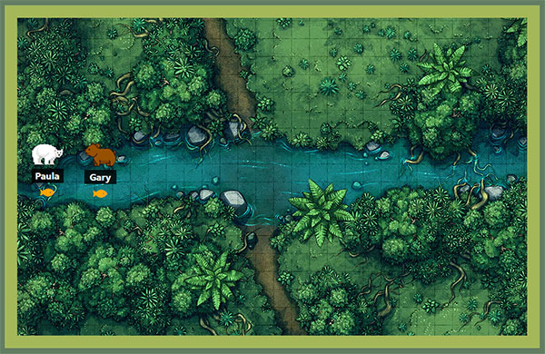

# NSS E12 Exercise - Bear Watcher

## Description:
The objective of the exercise was to create a Bear Watcher that took input from the user and tracked bears. This exercise was our introduction to ES6 Modules.

## Features:
1. Takes name, image url, and bear type from user and generates an icon for the bear.
1. Clicking the fish button under the bear icon catches a fish.
1. Bear Watcher tracks how many fish your bear has caught and displays the number on the bears card.
1. Bear Watcher tracks when the user started tracking their bear.
1. Project uses HTML, CSS, Vanilla JS, JQuery, Bootstrap, and ES6 Modules. 
1. Project has responsive design.

## Screenshots:
##### Main View / User Input

##### Bear Icons Generated by User

##### Cards Displayed on Icon Click

##### Responsive Design

## How To Run:
> Project is deployed at [https://logandevelopment.io/projects/bear-watcher/index.html](https://logandevelopment.io/projects/bear-watcher/index.html)
